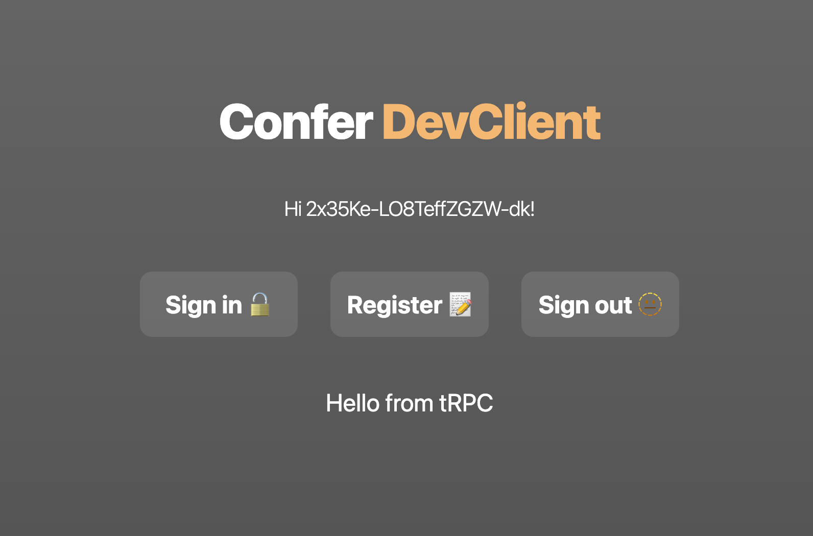
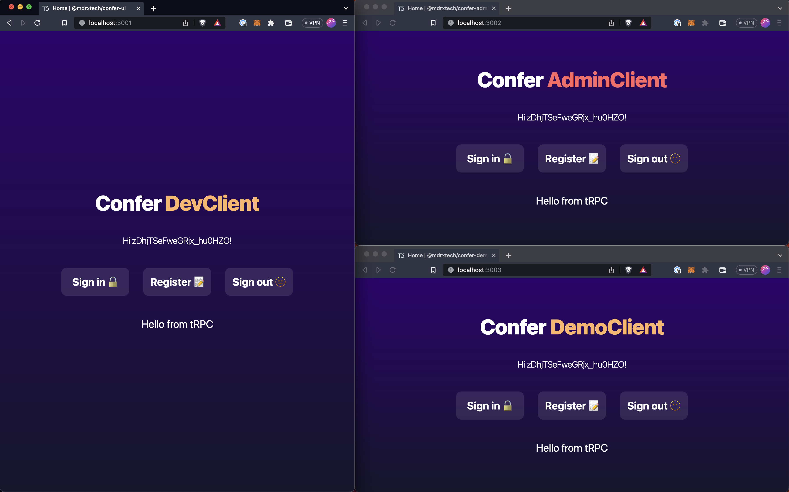

# Confer

An OIDC provider with typesafe integrations for ReactQuery, NextJS and tRPC.

Uses a fully certified [oidc-provider](https://github.com/panva/node-oidc-provider/) under the hood.

Out the box support for Authorization Code with PKCE.

Supports skipping consent screens for first-party clients.

```
pnpm install
open http://localhost:3001
```

Click "Log in".

1. You will be redirected to `/api/confer/sign-in` and then `/api/oidc/auth` to start auth flows
1. If not logged in, you will redirected to `/confer/sign-in`, enter user credentials
1. If successful, you will be redirected to `/api/confer/sign-in/[id]`, `/api/confer/redirect` and finally `/`
1. Enjoy your session



